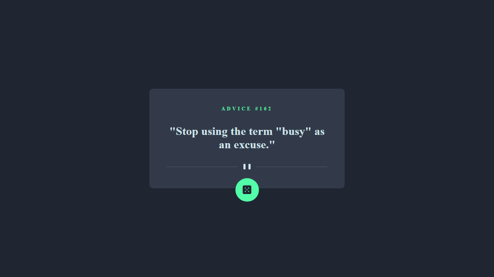
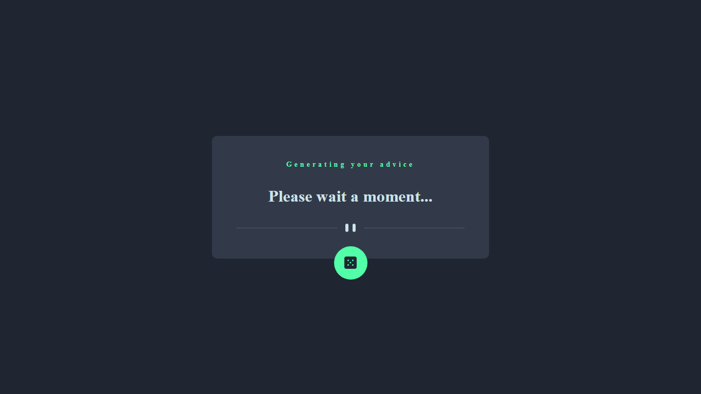
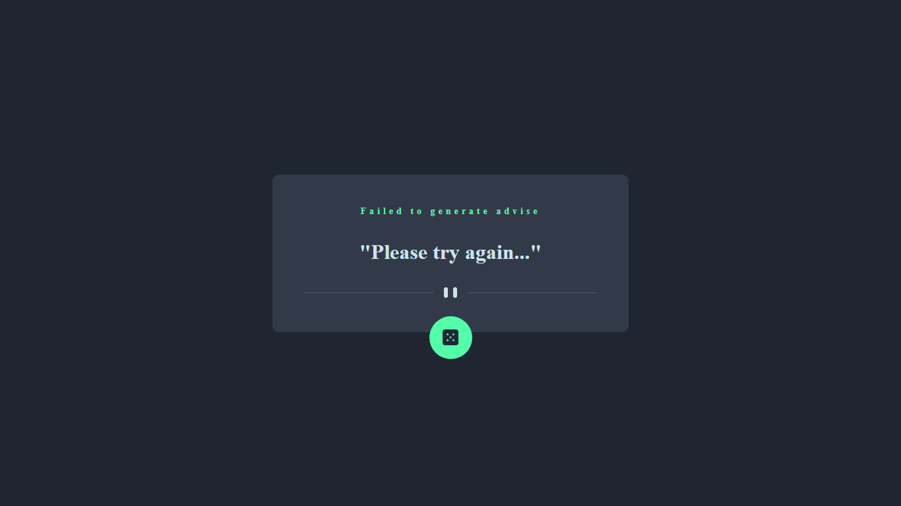

# Table of contents

- [Overview](#overview)
  - [Functionalities](#functionalities)
  - [Screenshot](#screenshot)
  - [Links](#links)
- [My process](#my-process)
  - [Built with](#built-with)

## Overview

### Functionalities

Users should be able to:

- View the optimal layout for the app depending on their device's screen size.
- See hover states for all interactive elements on the page.
- Generate a new piece of advice by clicking the dice icon.
- See the appropriate loading message when network connectivity is slow.
- See an error message if there was a problem making the request.

### Screenshot

### Links

- Github repository: [Advice Generator Repository](https://github.com/JoshuaAsistio/Advice-Generator-App)
- Live Site URL: [Advice Generator site](https://joshuaasistio.github.io/Advice-Generator-App/)

## My process

### Built with

- Semantic HTML5 markup
- CSS custom properties
- Flexbox
- CSS Grid
